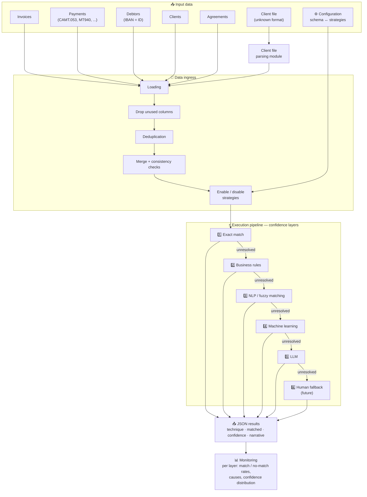
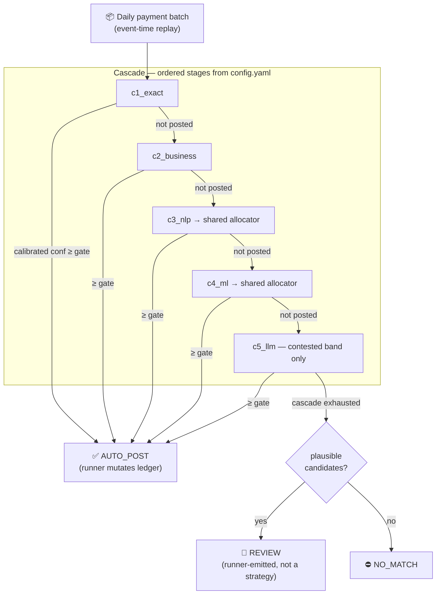
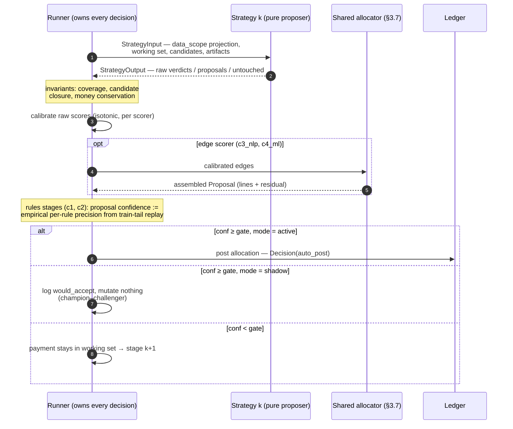
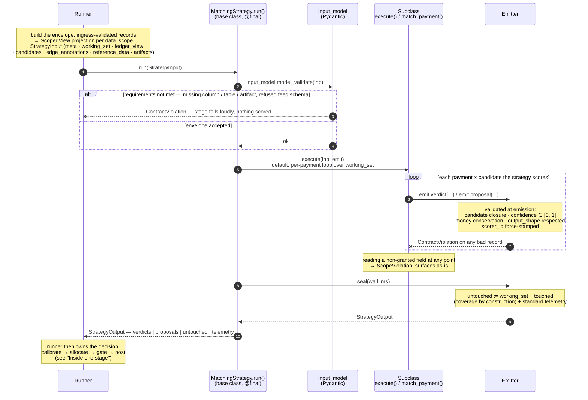

# reconbench -- pluggable payment-invoice reconciliation + benchmark harness

Implements the strategy stack from the design-requirements document as plug-and-play components toggled per scenario in `config.yaml`, and an event-time benchmark pipeline that replays a factoring book as close to the real process as a harness allows.

# Architecture — Automatic Reconciliation & Allocation Pipeline

## Overview

The solution automatically reconciles payments with invoices through a modular pipeline
organized in **confidence layers**. Each layer attempts to match the cases left unresolved by
the previous ones, from the most deterministic methods (exact match) to the most heuristic
(LLM), with a human fallback as a last resort.



---

## 1. Input data

| Data | Description |
|---|---|
| **Invoices** | Invoices to be reconciled with payments |
| **Payments** | Incoming payments, potentially from multiple sources (CAMT.053, MT940, …) |
| **Debtors file** | Debtor referential (IBAN as identifier, plus metadata) |
| **Clients file** | Client referential (same logical structure as debtors) |
| **Agreements** | Contractual links between debtors and clients — the merge key across tables |
| **Configuration** | Maps a data schema to the set of enabled reconciliation strategies |
| **Client file** *(optional)* | File provided by the client, in a format unknown in advance |

### Configuration & data schemas

Input data can come from heterogeneous sources with different levels of richness.
Example: a payment from a **CAMT.053** carries a complete remittance information field, whereas
an **MT940** has a truncated one. The configuration therefore maps each **data schema** to a
set of **enabled/disabled strategies**, so the pipeline automatically adapts to the quality of
the available data.

### Client file

The client may provide a file that directly contains the payment ↔ invoice reconciliation
information. Its format is not known in advance (entirely up to the client). A **dedicated
parsing module** is therefore required to:

- detect/interpret the file format,
- normalize it as a standard input,
- make it usable by the data ingress step and downstream strategies.

---

## 2. Data ingress

The step responsible for preparing the data before execution:

1. **Loading** the various sources;
2. **Cleaning**: dropping unused columns;
3. **Deduplication** of rows based on the significant columns;
4. **Merge & consistency checks**: joining the tables (invoices, payments, debtors, clients,
   agreements) and verifying incompatibilities;
5. **Configuration resolution**: enabling/disabling reconciliation and allocation strategies
   based on the detected data schema.

---

## 3. Execution pipeline

### Single interface contract

> **Core principle: every solution shares exactly the same input and output format.**

Whatever the technique (exact match, business rules, NLP, ML, LLM, human), each building
block implements the **same contract**:

```
Inputs  : invoices, payments, debtors, clients, agreements (+ client file when available)
          + the still-unresolved cases coming from the previous layers
Outputs : JSON records in the standard format (see "Output format")
```

This abstraction makes every layer:

- **debuggable** individually — each solution can be run and tested in isolation with the same data;
- **monitorable** uniformly — metrics are comparable across layers;
- **interchangeable** — a strategy can be added, removed, or reordered without impacting the rest of the pipeline.

```mermaid
flowchart LR
    subgraph SI["StrategyInput — scoped, read-only"]
        WS["working_set<br/>payments still unresolved"]
        LV["ledger_view<br/>open items,<br/>remaining balances"]
        CD["candidates<br/>payment_id → invoice_ids<br/>(shared blocking)"]
        AR["reference_data · artifacts<br/>fitted models, calibrators, priors"]
    end

    SI --> ST["Strategy — pure proposer<br/>no thresholds · no ledger mutation · no sieving"]
    ST --> SO

    subgraph SO["StrategyOutput"]
        V["verdicts<br/>one RAW score per<br/>candidate edge"]
        P["proposals<br/>allocation lines + residual<br/>(money-conserving)"]
        U["untouched<br/>payments not scored<br/>(coverage: touched ∪ untouched<br/>= working set)"]
        T["telemetry"]
    end

    SO --> R["Runner<br/>calibrate → allocate → gate → post"]
```



### Confidence layers

Strategies run in cascade, from the most reliable to the most uncertain. Each layer is a **pure proposer**: it scores or proposes and returns the standard envelope (`StrategyInput → StrategyOutput`, `contracts.py`). It does not calibrate, threshold, allocate under constraints, or mutate the ledger — the runner does. Two output shapes exist:

- **Edge scorer** — emits `verdicts` (one raw confidence per candidate pair); the runner calibrates the scores and the shared allocator (3.7) assembles the allocation.
- **Structural proposer** — emits `proposals` (allocation lines + residual) directly and must satisfy money conservation itself.

| # | Layer | Description |
|---|---|---|
| 1 | **Exact match** | Deterministic matches (references, exact amounts, …) |
| 2 | **Business rules** | Business rules, e.g. deduction/levy rates applied to payments |
| 3 | **NLP / fuzzy matching** | Text understanding and approximate matching (remittance info, approximate references) |
| 4 | **Machine learning** | Classification, plus other ML approaches to be implemented later |
| 5 | **LLM** | Reconciliation of the hardest cases through a large language model |
| 6 | **Human fallback** *(future work)* | Escalation to an operator, with maximum pre-collected context to ease the decision |

#### The cascade as a sieve

Cascade order is the sieve: stage *k+1* sees only the payments stage *k* did not post.
Acceptance happens in the runner's gate, not the strategy; the human tier is not a strategy at all, the runner routes whatever survives the cascade.



#### Inside one stage — runner vs strategy

What the linear picture hides is the division of labour at every stage. The strategy only proposes; everything decision-shaped is runner-owned:



### Solution details

The solution is a sequence of strategies --atomic reconciliation approachs-- which are documented below. The `<...>` areas are **placeholders to fill in** as implementation progresses.
Strategies --through their respective sources-- are graded as such:
- **[P]** peer-reviewed / benchmarked,
- **[G]** grey literature with technical substance,
- **[V]** vendor / consultancy (landscape only).

Each strategy below is described by **principle**, **source**, and **implementation rules**.

#### 3.0 — Strategy base class (`MatchingStrategy`)

Every strategy in 3.1–3.5 is a subclass of `MatchingStrategy`, the executable form of the single interface contract. The design is **template method + validating emitter**: the base class owns `run()` end-to-end — input checking, timing, output assembly, invariant enforcement — and a subclass never constructs a `StrategyOutput` at all. It only *emits* verdicts and proposals through an `Emitter` that validates each record the moment it is produced.

What the base class enforces, and how:

| Contract rule | Enforcement |
|---|---|
| Coverage (no silent drops) | impossible to violate — `untouched` is derived in `seal()` |
| Candidate closure | at emission, on verdicts **and** proposal lines |
| Money conservation, balance respect | at emission (runner assert kept) |
| Raw uncalibrated confidence in `[0, 1]` | validated per record |
| `scorer_id = id@version` | force-stamped by the emitter, not injectable |
| No thresholds inside a strategy | runner-owned gate keys rejected at `__init__` |
| Edge scorer emits no proposals | `output_shape` checked at emission |
| Read-only inputs / data scope | `ScopedView` (unchanged) |
| Required artifacts (GBM model, verifier, …) | declared in `requires_artifacts`, checked before `execute()` |
| Required inputs beyond artifacts (fields, tables, feed schema) | strategy-declared `input_model` (Pydantic), validated in `run()` before `execute()` |
| Standard telemetry | automatic (`n_payments_seen`, `n_edges_scored`, `wall_ms`) |

A violated rule raises `ContractViolation` and fails the run loudly.

**`StrategyInput` — the working set, as a Pydantic contract**

Everything a strategy may see arrives in one frozen envelope — the **working set** — built by
the runner for each stage. The envelope is checked at three moments, each with its own
failure mode, so bad data can never reach `execute()` silently:

| moment | check | failure |
|---|---|---|
| ingress (once per batch) | canonical Pydantic models parse the loader's rows — types, minor units, id integrity | `ValidationError`: malformed source data never enters the pipeline |
| stage build | runner projects every record to the strategy's `data_scope` | reading a non-granted field raises `ScopeViolation` (absent, not empty) |
| `run()` → `_check_input()` | the strategy's declared `input_model` re-validates the envelope | `ContractViolation` naming the strategy and what is missing — the stage fails loudly *before* scoring anything |

One round-trip through the contract — how the envelope is built, validated, processed, and
what comes back:



```python
class WorkingSetMeta(BaseModel):
    """Batch-level facts about the working set. Requirement validators read
    THIS — never the records, which are already scope-projected."""
    model_config = ConfigDict(frozen=True)

    as_of: date            # event-time date of the replayed batch; ledger_view is "as of" this day --> HOW WOUld this work at runtime ?
    currency: str          # ISO-4217. One currency per run — ingress rejects mixed books
    source_schema: str     # payment feed schema, e.g. "camt.053", "mt940" — drives strategy enablement
    stage_id: str          # cascade stage this envelope was built for, e.g. "c3_nlp"
    train_end: date        # point-in-time boundary: every artifact was fitted strictly before this --> how would this work at runtime -- outside of bench
    granted_scope: Mapping[str, frozenset[str]]
    # table -> granted columns, resolved from strategies.<id>.data_scope.
    # A denied table (e.g. `debtor_names: false`) is absent from the mapping entirely.


class Payment(BaseModel):
    """Canonical payment record — the FULL field universe, single source of
    truth for names and types. A given strategy sees only the
    granted_scope["payments"] subset; anything else raises ScopeViolation."""
    # To be completed with full data review and regularly updated
    model_config = ConfigDict(frozen=True)

    payment_id: str                         # opaque, stable, unique
    amount_minor: PositiveInt               # integer minor units (cents); floats never appear
    value_date: date
    debtor_id_hint: str | None = None       # runner-derived: IBAN looked up in the debtor referential
    payer_name_raw: str | None = None       # as received on the wire; unnormalized
    remittance_text: str | None = None      # free text; None on truncated feeds (MT940)
    reference_tokens: tuple[str, ...] = ()  # runner-derived tokens from remittance_text —
                                            # lets c1/c2 match references without seeing free text


class OpenItem(BaseModel):
    """Canonical open invoice as of meta.as_of — one entry of the ledger view."""
    # To be completed with full data review and regularly updated
    model_config = ConfigDict(frozen=True)

    invoice_id: str
    debtor_id: str
    factor_ref: str            # factor-side numbering
    seller_ref: str            # seller-side numbering (both are cited in the wild)
    amount_minor: PositiveInt  # face amount
    remaining_minor: int       # open balance, 0 < remaining <= amount;
                               # no allocation line may exceed it
    issue_date: date
    due_date: date


class EdgeAnnotation(BaseModel):
    """Runner-computed, per candidate edge. How earlier stages talk to later
    ones without breaking "pure proposer" — e.g. the contested band c5_llm
    adjudicates is marked here, never inside a strategy."""
    model_config = ConfigDict(frozen=True)

    prior_edge_p: float | None = None  # calibrated posterior from the best earlier scorer
    source_stage: str | None = None    # stage that produced the prior


class StrategyInput(BaseModel):
    """The working set. Frozen, scoped, complete — a strategy needs nothing
    else. Subclass it (see "Declaring requirements") to state what your
    strategy cannot run without."""
    model_config = ConfigDict(frozen=True, arbitrary_types_allowed=True)

    meta: WorkingSetMeta

    working_set: tuple[ScopedView[Payment], ...]
    # Payments still unresolved after stages 1..k-1 (the sieve). Coverage is
    # defined against this: every payment ends up touched or untouched.

    ledger_view: Mapping[str, ScopedView[OpenItem]]
    # invoice_id -> open item, event-time consistent as of meta.as_of.

    candidates: Mapping[str, tuple[str, ...]]
    # payment_id -> candidate invoice_ids from the SHARED blocking step (one
    # candidate universe per payment per stage). Candidate closure is defined
    # against this mapping:
    #   keys   == every payment_id in working_set (possibly an empty tuple),
    #   values ⊆ ledger_view keys.

    edge_annotations: Mapping[tuple[str, str], EdgeAnnotation] = {}
    # (payment_id, invoice_id) -> runner annotations; keys ⊆ candidate edges.

    reference_data: Mapping[str, Any] = {}
    # Static referentials granted by data_scope, e.g. "debtor_names".

    artifacts: Mapping[str, Any] = {}
    # Fitted objects delivered platform-side (GBM model, calibrator, encoder,
    # frozen BehaviourStats priors), all fitted strictly before
    # meta.train_end. Keys must cover the strategy's requires_artifacts.
```

`ScopedView[T]` is a typed read-only proxy over a record already validated against its
canonical model: granted fields read normally, everything else raises `ScopeViolation`.
Validation happens once at ingress, scoping once per stage — a strategy never re-parses
records.

*Formatting rules — what a loader (`datagen` or `prod_loader`) must put forth:*

- **Money** — `amount_minor` / `remaining_minor` are integers in minor units (cents).
  Floats never enter the contract; tolerances and dilution slack are runner-side knobs.
- **Dates** — `datetime.date` (ISO-8601 in files), event-time consistent: nothing in the
  envelope may postdate `meta.as_of`, and no artifact may see data past `meta.train_end`.
- **Identifiers** — opaque stable strings, unique within their table; `candidates` and
  `edge_annotations` reference them by value.
- **Missing values** — `None` (or the field absent), never `""` or `0`: zero reads as
  information (cf. behaviour priors, where missing history gets neutral priors, not zeros).
- **Free text** — delivered raw (`payer_name_raw`, `remittance_text`); normalization is
  runner-owned and lands in derived fields (`reference_tokens`).
- **Currency** — one per run, declared once in `meta.currency`; ingress rejects mixed books.

*Who builds each part of the envelope:*

| envelope part | built by | from |
|---|---|---|
| `Payment` / `OpenItem` records | loader, validated at ingress | source files (CAMT.053, MT940, invoice book) |
| `reference_tokens`, `debtor_id_hint` | runner, derived at ingress | remittance text; IBAN ↔ debtor referential |
| `ledger_view` | runner | open items as of `meta.as_of` |
| `candidates` | runner | shared blocking (config `candidates:`) |
| `edge_annotations` | runner | calibrated scores of earlier stages |
| `reference_data` | loader referentials, filtered by `data_scope` | debtor / client books |
| `artifacts` | platform-side training, frozen at `train_end` | training window only |
| `meta` | runner | config + batch context |

**Declaring requirements — how a strategy "cries loudly"**

A strategy with hard input needs ships its own `input_model`: a subclass of `StrategyInput`
whose `model_validator`s express the requirement. The base class runs
`input_model.model_validate(inp)` inside `_check_input()`, so a working set that does not
match what the strategy requires fails the stage upfront — before a single candidate is
scored — as a `ContractViolation` naming the strategy and the missing pieces.

Rules for these validators:

- Read `meta` (especially `granted_scope`), `artifacts` keys, `reference_data` keys, and
  mapping keys — **never record fields**. Records are scope-projected; probing them inside
  a validator is itself a scope breach.
- `input_model` defaults to `StrategyInput`: a strategy with no special needs declares nothing.
- `requires_artifacts` remains the shorthand for artifact presence; `input_model` is for
  everything richer — required columns, required tables, feed-schema constraints.

```python
class C3NlpInput(StrategyInput):
    """c3_nlp cannot run blind: it needs text signal and the name referential."""

    @model_validator(mode="after")
    def _requires(self):
        need = {
            "payments": {"payment_id", "reference_tokens", "payer_name_raw"},
            "invoices": {"invoice_id", "factor_ref", "seller_ref", "debtor_id"},
        }
        for table, cols in need.items():
            missing = cols - self.meta.granted_scope.get(table, frozenset())
            if missing:
                raise ValueError(f"needs {table} columns {sorted(missing)}")
        if "debtor_names" not in self.reference_data:
            raise ValueError("needs the debtor_names referential")
        if self.meta.source_schema == "mt940":
            raise ValueError("mt940 narratives are truncated — the schema map "
                             "should have disabled c3_nlp for this feed")
        return self


class C3Nlp(MatchingStrategy):
    strategy_id = "c3_nlp"
    version = "2.1.0"
    output_shape = "edge_scorer"
    input_model = C3NlpInput   # validated by run() before execute()
```

The schema → strategy configuration map (see "Configuration & data schemas") is the
*intended* control for feed quality; the `input_model` is the loud backstop for the day the
configuration forgets.

**Skeleton**

```python
class MatchingStrategy(ABC):
    """Pure proposer: StrategyInput -> StrategyOutput. No thresholds,
    no ledger mutation, no sieving. The base class IS the contract."""

    # declared identity, validated at class-definition time
    strategy_id: ClassVar[str]
    version: ClassVar[str]
    output_shape: ClassVar[Literal["edge_scorer", "structural", "both"]]
    requires_artifacts: ClassVar[tuple[str, ...]] = ()
    input_model: ClassVar[type[StrategyInput]] = StrategyInput  # see "Declaring requirements"

    # runner-owned decision knobs a strategy may never receive
    RESERVED_CFG_KEYS = frozenset({"accept_threshold", "target_error", "mode"})

    def __init_subclass__(cls, **kw):
        # registration replaces the @strategy decorator; identity is mandatory
        super().__init_subclass__(**kw)
        for attr in ("strategy_id", "version", "output_shape"):
            if not getattr(cls, attr, None):
                raise TypeError(f"{cls.__name__} must declare {attr}")
        STRATEGY_REGISTRY[cls.strategy_id] = cls

    @final
    def __init__(self, cfg: dict):
        leaked = self.RESERVED_CFG_KEYS & cfg.keys()
        if leaked:
            raise ContractViolation(
                f"{self.strategy_id}: {leaked} are runner-owned gates")
        self.cfg = MappingProxyType(dict(cfg))   # read-only
        self.configure(self.cfg)                 # subclass hook

    @final
    def run(self, inp: StrategyInput) -> StrategyOutput:
        self._check_input(inp)          # input_model.model_validate(inp): required
                                        # artifacts, fields, tables — fail before scoring
        emit = Emitter(self, inp)       # the validating gatekeeper
        t0 = time.perf_counter()
        try:
            self.execute(inp, emit)
        except ScopeViolation:
            raise                       # scope breaches surface as-is
        except Exception as e:
            raise StrategyError(self.strategy_id, e) from e
        return emit.seal(wall_ms=(time.perf_counter() - t0) * 1000)

    # ------------------------------------------- subclass surface
    def configure(self, cfg) -> None:   # optional
        pass

    def execute(self, inp: StrategyInput, emit: "Emitter") -> None:
        """Default: per-payment loop, coverage by construction. Batch
        strategies (c4_ml, c5_llm) override execute() directly and keep
        emitting through `emit`."""
        for p in inp.working_set:
            cands = [inp.ledger_view[i]
                     for i in inp.candidates.get(p.payment_id, ())]
            self.match_payment(p, cands, inp, emit)

    def match_payment(self, payment, candidates, inp, emit) -> None:
        raise NotImplementedError(
            "implement match_payment() or override execute()")


class Emitter:
    """Only path to StrategyOutput. Validates every record at emission."""

    def verdict(self, payment_id, invoice_id, match, confidence,
                rationale="", evidence=None):
        ...  # candidate closure; match in {True, False, None};
             # confidence None or in [0, 1]; scorer_id force-stamped;
             # no duplicate edge per stage

    def proposal(self, payment_id, lines, residual_minor,
                 residual_explained, confidence, rationale):
        ...  # output_shape != "edge_scorer"; candidate closure per line;
             # sum(lines) + residual == payment.amount_minor;
             # 0 < line.amount_minor <= remaining_minor;
             # at most one proposal per payment per stage

    def note(self, **telemetry): ...    # strategy-specific counters

    def seal(self, wall_ms) -> StrategyOutput:
        ...  # untouched = working_set - touched; standard telemetry + notes
```

**Configuration example**

A strategy declares its identity in code; everything tunable lives in `config.yaml`.
Strategy-owned knobs go under `strategies.<id>` and reach `configure(cfg)`; decision
variables (gates, mode) stay on the cascade stage — the runner pops them before
instantiation, and any that leak into the strategy's cfg raise `ContractViolation`.

```python
class C3Nlp(MatchingStrategy):
    strategy_id = "c3_nlp"
    version = "2.1.0"
    output_shape = "edge_scorer"        # emitting a proposal would raise

    def configure(self, cfg):
        self.w_ref = cfg.get("weight_ref", 0.7)
        self.w_name = cfg.get("weight_name", 0.3)

    def match_payment(self, payment, candidates, inp, emit):
        for iv in candidates:
            emit.verdict(payment.payment_id, iv.invoice_id, match=None,
                         confidence=self._similarity(payment, iv),
                         evidence={"ref_fuzzy": ..., "name_partial": ...})
```

```yaml
strategies:
  c3_nlp:
    weight_ref: 0.7          # strategy-owned -> passed to configure()
    weight_name: 0.3
    data_scope:              # enforced projection (see "Data scope")
      payments: [payment_id, reference_tokens, payer_name_raw]
      invoices: [invoice_id, factor_ref, seller_ref, debtor_id]

bench:
  scenarios:
    - name: rules_nlp
      cascade:
        - {id: c1_exact}
        - {id: c3_nlp, accept_threshold: 0.9}   # gate is runner-owned:
                                                # stage key, never strategy cfg
```

#### 3.1 — Exact match (`c1_exact`)

- **Principle**: deterministic 1:1 match. Rule R1 fires when exactly one candidate's `factor_ref` or `seller_ref` appears among the payment's reference tokens and its remaining balance fits the payment within tolerance.
- **Matching criteria**: `<structured reference, exact amount, debtor IBAN, ...>`
- **Data prerequisites**: `<required columns>`
- **Confidence**: `1.0` (deterministic).
- **Known limitation**: silent on non-injective references (the noisy-reference, N:M tail), which is the residual passed to later layers by construction.

#### 3.2 — Business rules (`c2_business`)

- **Principle**: business rules applied to explain discrepancies and match non-exact cases.
  - **R1** -- Deduction/levy rates on payments: `<description, rate, scope>`
  - **R2** — two or more cited references whose remaining balances sum to the payment within (doubled) tolerance → a batch (1:N) allocation.
- **Data scope**: adds `debtor_id_hint` (payment) and `debtor_id`, `due_date` (invoice) over 3.1.
- **Confidence**: `<per rule, to be defined>`

#### 3.3 — NLP / fuzzy matching (`c3_nlp`)

- **Principle**: approximate string matching on remittance references and payer name, for
  corrupted references, abbreviations, and reordered tokens. Per-edge similarity is a
  weighted blend of best token/reference fuzzy ratio and partial-ratio name match.
- **Source**: edit-distance and token-similarity families (Levenshtein, Jaro–Winkler,
  token-sort) — settled technology; Christen, *indexing techniques for record linkage*,
  TKDE 2011 [P]. Probabilistic record linkage (Fellegi–Sunter, JASA 1969 [P]; Splink,
  fastLink) is available as an alternative *unsupervised* scorer (`problink_fs`) over the
  same comparison fields.
- **Output shape**: edge scorer (verdicts only) → runner allocator.
- **Data scope**: payment `reference_tokens`, `payer_name_raw`; invoice refs, `debtor_id`; `payment remittance info`
  the `debtor_names` reference table.
- **Implementation rules**: emit the raw similarity as confidence; set **no accept threshold** inside the strategy — the runner fits an isotonic calibrator on a validation slice and applies the stage gate. Score only candidate pairs.
- **Known limitation**: signal depends on remittance richness; on truncated MT940 narratives the layer is disabled via the schema → strategy configuration map.

#### 3.4 — Machine learning (`c4_ml`)

Supervised classification of candidate pairs (match / no match) with gradient-boosted trees over engineered features — amount deltas, date lags, reference exact/fuzzy hits, name similarity, encoder similarity, frozen debtor-behaviour priors, and candidate-set structure.
- **Implementation rules**: models are fit platform-side on the **training window only**; behavioural aggregates are frozen at `train_end` (point-in-time discipline). Confirmed matches must be timestamped — the principal methodological trap is label leakage from operator confirmations dated after the split. The fitted model and its calibrator arrive via `artifacts`; the strategy emits **raw** scores only, isotonic-calibrated by the runner before gating.
- **Evaluation**: precision/recall/F1 at the edge level, plus calibration of the item-level confidence that drives auto-post.
- **Training data**: historical lettrage as free supervision (operator-confirmed allocations). broadest of the automated layers — amounts, dates, `debtor_id_hint`, `payer_name_raw`, `remittance_text`, refs, behaviour.
- **Features**
  - **LSM — learnable similarity measures**
    - **Principle**: two-level learning (the MARLIN pattern).
      - Level 1: the per-field string similarities are themselves trained artifacts — an edit distance with affine gaps whose operation costs are learned by EM over confirmed matched string pairs, and a token vector-space similarity with SVM-learned token weights instead of raw TF-IDF.
      - Level 2: the per-field similarities feed
      a record-level supervised classifier — here the GBM — which stays the sole edge scorer.
    Magellan industrialises the pattern: enumerate (field × similarity function) features automatically from attribute types, select the classifier by cross-validation, and iterate via a mistake-driven debug loop (each false positive/negative traced to a data, label, feature, or model fix).
    - **Source**: learnable similarity measures (Bilenko & Mooney, https://www.cs.utexas.edu/~ml/papers/marlin-kdd-03.pdf, KDD 2003 [P]) and Magellan (Konda et al., https://pages.cs.wisc.edu/~anhai/papers/magellan-vldb16.pdf, VLDB 2016 [P]) established the feature-engineering + supervised-classifier pattern;
    - **Data Scope**: the fields the fuzzy features already see — payment `reference_tokens`, `payer_name_raw` vs invoice `factor_ref`/`seller_ref`, `debtor_names` — plus train-window confirmed allocations as the pair corpus.
    - **Implementation rules**: the Entity Matching trained edit distance needs *positive pairs only* (confirmed payment-token ↔ invoice-ref alignments), fitted strictly on the training window; ship it as an additional feature (e.g. `ref_learned_dist`) next to `ref_best_fuzzy` in `FEATURE_NAMES`, never as a replacement gate. Keep the two levels separate: learned similarities emit raw scores, the GBM scores the edge, the runner decides.
  - **BF Clf — behavioural-features classifier**
    - **Principle**: per-debtor aggregates of historical payment behaviour, computed *as of a
      reference date* and joined on `debtor_id`: last-k invoice outcomes, counts and sums of
      paid / late / outstanding items, mean and σ of payment lag, dilution rate, payment
      frequency. In the source, invoice-level features alone gave a poor model; the historical aggregates carried the accuracy (best model: gradient-boosted trees). These priors are constant across a payment's candidates, so their discriminating power arrives through interactions — e.g. `debtor_hist_lag_z`, the candidate's lag normalised by the debtor's own historical (μ, σ).
    - **Source**: Behavioural/historical features dominate invoice-level ones
    (Appel et al., https://arxiv.org/abs/1912.10828, 2019 [G]).
    - **Data Scope**: historical lettrage (confirmed allocations) + invoice `due_date`/
      `issue_date`, `debtor_id`. Realised in `BehaviourStats` (lag_mu, lag_sd, dilution) —
      extend with the paid/late/outstanding count and sum aggregates.
    - **Implementation rules**: aggregate on the training window only, frozen at `train_end`
      (TR-4.2) — the source's own leakage control is a strictly time-based split. Bound the
      look-back window instead of using all history (their accuracy peaked at w = 2–3 months; older behaviour *degrades* the model under debtor concept drift) — make w a tuned config knob. Missing history gets neutral priors, never zeros, wherever zero would read as good behaviour (the current defaults μ=10, σ=15, dilution=0.05 follow this rule).
  - **ES — encoder similarity**
    - **Principle**: replace the char n-gram TF-IDF cosine behind `encoder_sim` with a
      fine-tuned pre-trained transformer. Ditto's recipe: serialize the pair (remittance text ↔ invoice reference string) into one sequence and fine-tune as sequence-pair classification, plus three boosters — domain-knowledge injection (tag reference-number spans so attention finds them), summarization (keep only informative tokens within the max input length), and data augmentation (span deletion/shuffle manufactures hard examples that mimic exactly the MT940-style truncation and corruption this layer must survive). Ditto proper is a *cross-encoder* (jointly encodes the pair — most accurate, nothing cacheable); the per-string cache in `EncoderSim` implies a *bi-encoder* distilled from it (embed payment text and invoice refs independently, cosine at scoring time).
    - **Source**: The `encoder_sim` feature is the hook for a fine-tuned bi-encoder (Ditto, Li et al., https://arxiv.org/abs/2004.00584, VLDB 2021 [P]).
    - **Data Scope**: payment `remittance_text` vs invoice `factor_ref + seller_ref` — exactly what `EncoderSim.sim` receives today.
    - **Implementation rules**: swap only `EncoderSim.sim`; the interface, the raw-[0,1] output, and its role as one GBM feature are unchanged — no threshold appears. Fine-tune platform-side on train-window confirmed pairs as positives and hard negatives sampled from the same candidate blocks; deliver the model via `artifacts` like the GBM itself. Keep the per-string embedding cache — that constraint is what forces the bi-encoder (or precomputed-embedding) form.
  - **EAL — embedding-augmented linkage**
    - **Principle**: pretrained-embedding cosine similarity used as a comparison variable inside a Fellegi–Sunter-style probabilistic linkage (`fuzzylink`): fit a two-component mixture by EM over candidate-pair similarities (no labels required), have an LLM zero-shot label only the pairs whose match posterior sits near 0.5, refit a logistic layer on those labels, and iterate to convergence. Captures semantic equivalence (abbreviations, paraphrase, even cross-language payer names) that edit-distance comparisons miss.
    - **Source**: embedding-augmented linkage, Ornstein, [*Political Analysis*](https://joeornstein.github.io/publications/fuzzylink.pdf) 2025 [P]
    - **Data Scope**: the same text fields as ES; requires *no* labelled history — this is the unsupervised path for cold-start portfolios where `c4_ml`'s supervision does not exist yet.
    - **Implementation rules**: code available in R at https://joeornstein.github.io/software/fuzzylink/

#### 3.5 — LLM (`c5_llm`)

- **Principle**: select-from-candidates verifier on the **contested band only**. Earlier stages' calibrated scores define a band per payment; the LLM adjudicates that band, and positives that reconcile the amount form a proposal.
- **Source**:
  - frontier LLMs match or beat fine-tuned PLMs zero/few-shot and are more robust to unseen entities (Peeters, Steiner & Bizer, EDBT 2025 [P]).
  - Candidate-set (match/compare/select) formulations beat independent pairwise calls (COLING 2025 [P]).
  - Cost control by cheap-scorer-everywhere / LLM-on-band-only: BATCHER (ICDE 2024 [P]),
  - BoostER (WWW 2024 [P]).
  - Verbalised LLM confidence is poorly calibrated [P].
- **Data scope**: deliberately narrowed (no raw payer name / dates unless granted); free text reaches the model as `reference_tokens`, not `remittance_text`, by default.
- **Implementation rules**: the strategy calls the model only on band candidates the runner marks via `prior_edge_p`; one batched call per payment; abstain → `match=None`. Because verbalised confidence is unreliable, raw scores pass through the runner's calibrator and gate — the strategy sets **no** threshold. The production endpoint (`AnthropicLLMVerifier`) must return schema-validated JSON verdicts with an abstain option and token-level confidence, one retry then defer, and run **in-perimeter**. The shipped `mock` mode reads ground truth to price the *architecture* at a given verifier accuracy.

#### 3.6 — Human fallback (`c6`, *future work*)

- **Principle**: terminal routing of everything the cascade did not post. Payments with plausible candidates → `REVIEW`; none → `NO_MATCH`. Each item carries the aggregated context from prior layers (close candidates, calibrated scores, narratives) to minimise decision effort.
- **Source**: selective prediction / reject option (Chow 1970; El-Yaniv & Wiener, JMLR
  2010; Geifman & El-Yaniv, NeurIPS 2017 [P]); learning-to-defer, which optimises the automate/defer split against reviewer cost (Madras et al. 2018; Mozannar & Sontag, ICML
  2020 [P]).
- **Output shape**: not a proposer — the runner emits `REVIEW` / `NO_MATCH` decisions after
  the cascade is exhausted.
- **Implementation rules**: the review interface is out of scope for this harness. The
  feedback loop feeds confirmed allocations back as `c4_ml` labels under the same
  point-in-time / anti-leakage rule as 3.4.

#### 3.7 — Shared selection and decision layer

Not a confidence layer, but the two runner-owned components every edge scorer (3.3–3.5)
depends on. They are described here because several sources land on them and because they
are *why* strategies carry no thresholds or allocation logic of their own.

- **Allocation (selection)**: raw edges become a consistent allocation under
  amount/tolerance constraints in the runner, not in any classifier — single-invoice,
  subset-sum over top-k, or partial/installment fallback, in integer minor units with
  dilution slack.
  - **Source**: aggregate matching as a combinatorial problem, formalised as the Subset-Sum
    Matching Problem (Wu et al., ECAI 2025 [P]); at production scale the enumerator is
    swapped for MILP / CP-SAT behind the same interface.
  - **Rule**: classifiers score edges; the optimiser selects a consistent allocation and
    respects remaining balances. A classifier never votes an N:M allocation into existence.
- **Calibration and deferral (decision)**: each scorer's raw scores are isotonic-calibrated
  on a validation slice; the accept threshold is fitted to a target auto-post error on a
  risk–coverage curve.
  - **Source**: post-hoc calibration (Guo et al., ICML 2017 [P]); conformal,
    coverage-guaranteed deferral (Angelopoulos & Bates 2021 [P]) is the adoption-ready
    extension.
  - **Rule**: the operating point is a Finance-Ops-owned configuration variable, never a
    constant inside a strategy.

### Output format

Every strategy returns the same `StrategyOutput` envelope (`contracts.py`). It carries two record types plus an untouched list — no strategy returns a bare match flag, because the match/no-match decision belongs to the runner's gate, not the strategy.

**`Verdict`** — one raw, uncalibrated score per candidate edge (the edge-scorer output), eg:

```json
{
  "payment_id": "P-1042",
  "invoice_id": "F-8831",
  "match": null,
  "confidence": 0.71,
  "scorer_id": "c4_ml@2.0.0",
  "rationale": "",
  "evidence": {"ref_fuzzy": 0.62, "name_partial": 0.88}
}
```

- `match`: `true` / `false` / `null` (abstain or defer-to-scoring);
- `confidence`: **raw** edge score — the runner calibrates it before any threshold;
- `scorer_id`: strategy id + version, for per-layer monitoring and audit.

**`Proposal`** — a structural allocation under money conservation (the structural-proposer
output, and what the allocator assembles from verdicts):

```json
{
  "payment_id": "P-1042",
  "lines": [{"invoice_id": "F-8831", "amount_minor": 120000, "edge_confidence": 0.97}],
  "residual_minor": 0,
  "residual_explained": "DISCOUNT",
  "confidence": 0.97,
  "rationale": "R1_exact_ref_amount"
}
```

Invariant: `sum(lines.amount_minor) + residual_minor == payment.amount_minor`, and no line exceeds the invoice's remaining balance. The runner records the accepted proposal as a `Decision` (`auto_post` / `review` / `no_match`) with the **calibrated** confidence and the originating scorer.

---

## 4. Monitoring

Monitoring leverages the uniform output format to measure, **per layer**:

- the **no-match rate** and its causes;
- the **match rate** and the **distribution of the associated confidence scores**.

This makes it possible to identify the best-performing layers, detect drifts (e.g. a drop in
quality of a data source), and prioritize improvements.
## Run
```
pip install rapidfuzz lightgbm pyyaml polars scikit-learn # TODO: have a requirements.py
python -m reconbench.bench --config config.yaml
# -> outputs/bench_summary.csv, bench_report.md, decisions_<scenario>.csv
```

## Toggle strategies
Scenarios in `config.yaml` override the stack, e.g.
```yaml
- name: gbm_encoder_llm
  stack: {rules_cascade: true, scorer: gbm, encoder_feature: true, llm_verifier: true}
```
Component parameters (bands, tolerances, target auto-post error) live under
`strategies:` -- these are the Finance-Ops-owned decision variables (BR-0.4).

## Data honesty
The bundled generator produces a SYNTHETIC factoring book (N:M patterns,
dilution, reference corruption, seller-vs-factor numbering, payment-factory
payer mismatch). Its knobs must be re-calibrated on real portfolio marginals
before any absolute number is quoted; the harness's purpose is *controlled
strategy comparison*. To run on production data, implement
`reconbench/prod_loader.py` (schema contract in the docstring) -- nothing
else changes.

## Deliberate simplifications (vs the requirements doc)
* EncoderSim is char n-gram TF-IDF cosine -- an interface stand-in for a fine-tuned bi-encoder (swap `EncoderSim.sim`).
* MockLLMVerifier simulates a verifier of configurable accuracy using groundtruth: it measures the ARCHITECTURAL value of a verifier of quality `acc`, not any model. `AnthropicLLMVerifier` is the production stub (TR-5.x).
* Fellegi-Sunter uses 4 comparison fields under conditional independence.
* Allocator enumerates subsets (top-k) rather than MILP; swap for CP-SAT/CPLEX at production scale (interface unchanged).

---

# Configure and launch a run (contract cascade)

The contract runner (`reconbench.run`) is the primary entrypoint; it executes the standard strategy I/O contract (`strategy_io_contract.md`, executable form in `contracts.py`). The legacy monolithic bench (`reconbench.bench`) remains for reference.

## 1. Install

```bash
pip install rapidfuzz lightgbm pyyaml polars scikit-learn
```

## 2. Launch

```bash
python -m reconbench.run --config config.yaml                 # all scenarios
python -m reconbench.run --config config.yaml --only rules_ml # one scenario
```

`--only` appends to an existing `outputs/run_summary.csv`, so heavy scenarios
can be run one by one.

Outputs land in `outputs/`:
| file | content |
|---|---|
| `run_summary.csv` | headline metrics per scenario (coverage, precision by tier, LLM calls) |
| `run_report.md` | summary + per-stage funnels + gate audit |
| `decisions_<scenario>.csv` | one row per payment: action, stage, pattern, correctness |

## 3. Anatomy of `config.yaml`

```yaml
data:            # synthetic generator knobs -- OR replace with prod_loader (see below)
split:
  train_end: "2025-09-15"        # time-consistent split; strategies fit strictly before
candidates:      # shared blocking (one candidate universe per payment per stage)
strategies:      # per-strategy parameters AND data_scope (see 4.)
bench:
  scenarios:     # each scenario = a cascade, i.e. an ordered list of stages
    - name: rules_ml_llm
      cascade:
        - {id: c1_exact}
        - {id: c2_business}
        - {id: c4_ml}
        - {id: c5_llm, accept_threshold: 0.9}
```

Per-stage keys:
* `id` -- strategy from the registry (`c1_exact`, `c2_business`, `c3_nlp`, `c4_ml`, `c5_llm`).
* `mode` -- `active` (default) posts; `shadow` runs the identical path, logs `would_accept`, influences nothing. Champion-challenger is this flag.
* `accept_threshold` -- explicit gate on calibrated item confidence, OR
* `target_error` (in `strategies.<id>`) -- gate fitted on a train-tail dry replay to hit that stage error rate. Rules stages are gated too: each rule's empirical precision becomes its confidence, so a rule below appetite is refused (observe c2 accepting 0 at `target_error: 0.01`).
Cascade order is the sieve: stage k+1 sees only what stage k did not post.

## 4. Data scope -- giving a strategy less information

Each strategy's `data_scope` is an enforced projection: the runner builds its input from the whitelist, and probing a non-granted field raises `ScopeViolation` (absent, not empty). To narrow c5, edit YAML only:

```yaml
strategies:
  c5_llm:
    data_scope:
      payments: [payment_id, amount_minor, reference_tokens]   # no payer name, no dates
      invoices: [invoice_id, factor_ref, seller_ref, remaining_minor]
      debtor_names: false
```

`reference_tokens` is a runner-derived field (tokens extracted from remittance text), letting c1/c2 match references without ever seeing free text.

## 5. Running on production data

Implement `reconbench/prod_loader.py` (schema contract in its docstring: invoices, payments, historical lettrage as truth, debtor book) and swap the generator call in `run.py`'s `main()` for `prod_loader.load(...)`. Everything else -- scopes, gates, funnels, metrics -- is unchanged. Run in-perimeter; nothing calls external services unless a `c5_llm` endpoint backend is wired.

## 6. Adding a strategy

Current (implemented) pattern — register with the `@strategy` decorator and build the
envelope yourself:

```python
from reconbench.strategy_impls import strategy
from reconbench.contracts import StrategyInput, StrategyOutput, Verdict

@strategy("c6_graph")
class C6Graph:
    version = "0.1.0"
    def __init__(self, cfg): ...
    def run(self, inp: StrategyInput) -> StrategyOutput:
        ...  # read ONLY inp.working_set / ledger_view / candidates / reference_data
```

Then declare `strategies.c6_graph` (params + `data_scope`) and add `{id: c6_graph}` to a cascade. Contract rules the runner enforces at runtime: score only pairs in `candidates`; cover every working-set payment (verdicts or `untouched`); proposal lines + residual must equal the payment amount and respect remaining balances; no thresholds inside the strategy -- the gate is the runner's.

> **TODO — target pattern once `MatchingStrategy` (§3.0) lands.** The decorator, the
> hand-built envelope, and the list of rules to remember all disappear: subclassing the
> base class *is* the contract. Adding a strategy becomes:
>
> ```python
> from reconbench.contracts import MatchingStrategy
>
> class C6Graph(MatchingStrategy):
>     strategy_id = "c6_graph"          # registered by __init_subclass__
>     version = "0.1.0"
>     output_shape = "edge_scorer"      # or "structural" / "both"
>
>     def configure(self, cfg): ...     # strategy-owned knobs from strategies.c6_graph
>
>     def match_payment(self, payment, candidates, inp, emit):
>         for iv in candidates:
>             emit.verdict(payment.payment_id, iv.invoice_id,
>                          match=None, confidence=...)
>         # batch strategies override execute() instead
> ```
>
> The YAML side is unchanged (`strategies.c6_graph` params + `data_scope`, `{id: c6_graph}`
> in a cascade). Everything listed above as "rules the runner enforces" is then enforced at
> emission time by the base class — coverage is derived, candidate closure and money
> conservation are checked per record, `scorer_id` is force-stamped, and a gate key leaking
> into strategy cfg raises `ContractViolation`. A strategy with hard input needs also
> declares an `input_model` (§3.0) so a working set missing required fields, tables, or
> feed quality fails the stage upfront rather than mid-run. The runner's stage-level asserts (§7) remain
> as defense in depth. Migration checklist: implement `MatchingStrategy` + `Emitter` in
> `contracts.py`, port `c1`–`c5`, delete `_base_out`/`_finish` and the decorator, have the
> runner pop `mode`/gate keys before instantiation, then replace this section with the new
> pattern only.

## 7. Invariants asserted on every stage

coverage (no silent drops) - monotone sieve - conservation of money -
candidate closure - scope enforcement. A violated invariant fails the run
loudly rather than producing a quietly wrong ledger.

## Glossary

Terminology used throughout this document.

### Contract & base-class concepts (§3.0)

| Term | Definition |
|---|---|
| **`MatchingStrategy`** | The abstract base class every strategy (3.1–3.5) subclasses. |
| **Pure proposer** | The defining constraint on a strategy: it may only score or propose. It must never apply thresholds, mutate the ledger, or sieve/filter — those are runner-owned decisions. |
| **Contract** (single interface contract) | The shared input/output shape every layer (exact match, rules, NLP, ML, LLM, human) implements: `StrategyInput → StrategyOutput`, defined in `contracts.py`. Makes each layer individually debuggable, uniformly monitorable, and interchangeable. |
| **`ContractViolation`** | Exception raised when a strategy breaks a contract rule (e.g. tries to set a threshold, leaks a reserved config key, emits a malformed record). Fails the run loudly rather than silently. |
| **`ScopeViolation`** | Exception raised when code reads a field it wasn't granted via `data_scope`. Distinct from `ContractViolation` — surfaces "as-is" rather than being wrapped. |
| **`StrategyError`** | Wraps any other unexpected exception raised inside `execute()`, tagged with the strategy id. |
| **Coverage** (invariant) | Every pay ment in the working set must end up either *touched* (scored/proposed) or *untouched* — no silent drops. Enforced by construction: `untouched` is derived automatically in `seal()`, not asserted after the fact. |
| **Candidate closure** (invariant) | Every verdict/proposal line must reference a `(payment_id, invoice_id)` pair that actually appears in the `candidates` mapping — a strategy can't invent or score outside its candidate set. |
| **Money conservation** | Invariant on `Proposal` records: `sum(lines.amount_minor) + residual_minor == payment.amount_minor`, and no line exceeds an invoice's remaining balance. |
| **`scorer_id`** | Format `id@version` (e.g. `c4_ml@2.0.0`) identifying which strategy/version produced a verdict. Force-stamped by the `Emitter`, not settable by the strategy — used for per-layer monitoring/audit. |
| **`data_scope`** | Per-strategy YAML config declaring exactly which tables/columns/referentials a strategy may read. Enforced as a runtime projection (`ScopedView`); anything outside it raises `ScopeViolation`. Used deliberately to *withhold* information (e.g. narrowing what `c5_llm` sees). |
| **`requires_artifacts`** | Class attribute listing artifact keys (e.g. a fitted GBM model) a strategy needs before `execute()` can run; checked up front. |
| **`input_model`** | A strategy-declared Pydantic subclass of `StrategyInput` expressing additional hard requirements (required columns/tables/feed schema) beyond `requires_artifacts`. Validated in `run()` via `_check_input()` before any scoring happens — the strategy's way of "crying loudly" if the working set can't support it. |
| **`RESERVED_CFG_KEYS`** | Config keys (`accept_threshold`, `target_error`, `mode`) that belong to the runner, not the strategy. If they leak into a strategy's own config block, `__init__` raises `ContractViolation`. |
| **Output shape** | Declares what kind of records a strategy emits: `"edge_scorer"` (verdicts only), `"structural"` (proposals only), or `"both"`. Checked at emission time. |

### Envelope / data-model objects (§3.0)

| Term | Definition |
|---|---|
| **`StrategyInput`** | The frozen, read-only "working set" envelope the runner builds for each stage — everything a strategy is allowed to see: `meta`, `working_set`, `ledger_view`, `candidates`, `edge_annotations`, `reference_data`, `artifacts`. |
| **`WorkingSetMeta`** | Batch-level facts (`as_of` date, `currency`, `source_schema`, `stage_id`, `train_end`, `granted_scope`) that requirement validators inspect — never the records themselves, since those are already scope-projected. |
| **`working_set`** | The tuple of payments still unresolved after stages 1..k-1 of the cascade — what a given strategy actually operates on. |
| **`ledger_view`** | Mapping of `invoice_id → OpenItem`, i.e. the open invoices and their remaining balances, event-time consistent as of `meta.as_of`. |
| **`candidates`** | Mapping `payment_id → tuple of candidate invoice_ids`, produced by the shared blocking step — the "search space" a strategy is allowed to score against for each payment. |
| **`edge_annotations`** | Runner-computed per-edge metadata (e.g. `prior_edge_p`, `source_stage`) that lets later stages (notably `c5_llm`) know what earlier stages concluded about a pair, without a strategy having to look at another strategy's internals. |
| **`reference_data`** | Static referential tables (e.g. `debtor_names`) granted to a strategy via `data_scope`. |
| **`artifacts`** | Pre-fitted objects delivered platform-side (GBM model, calibrator, encoder, frozen behaviour priors), all fitted strictly before `meta.train_end`. |
| **`ScopedView[T]`** | A typed read-only proxy over an already-validated record: granted fields read normally, anything else raises `ScopeViolation`. |
| **`Payment`** | Canonical payment record schema — full field universe (payment_id, amount_minor, value_date, debtor_id_hint, payer_name_raw, remittance_text, reference_tokens, etc.); a strategy only sees the subset its `data_scope` grants. |
| **`OpenItem`** | Canonical open-invoice record as of `meta.as_of` — one line of the ledger view (invoice_id, debtor_id, factor_ref, seller_ref, amount_minor, remaining_minor, dates). |
| **`reference_tokens`** | Runner-derived tokens extracted from a payment's free-text remittance info, letting reference-matching strategies (c1/c2) work without ever reading raw free text. |
| **`debtor_id_hint`** | Runner-derived field: the debtor looked up from the payment's IBAN against the debtor referential. |
| **`train_end`** | Point-in-time boundary: every fitted artifact must have been trained strictly before this date — the anti-leakage discipline underlying ML/behavioural features. |
| **`as_of`** | Event-time date of the batch being replayed; `ledger_view` reflects the ledger's state "as of" this day. |

### Cascade & runner mechanics

| Term | Definition |
|---|---|
| **Confidence layer** | One of the pipeline's cascade stages, ordered from most deterministic to most heuristic: exact match → business rules → NLP/fuzzy → ML → LLM → human fallback. |
| **Cascade / sieve** | The ordering discipline: stage *k+1* only ever sees payments that stage *k* did not post. Cascade order **is** the filtering mechanism. |
| **Runner** | The owner of every decision a strategy is forbidden to make: calibration, allocation, gating, and ledger mutation ("posting"). Strategies propose; the runner decides. |
| **Gate** | The runner-owned acceptance threshold (`accept_threshold` or a fitted `target_error`) applied to a *calibrated* confidence score to decide whether a proposal auto-posts. |
| **Edge scorer** | A strategy output shape that emits `verdicts` — one raw confidence per candidate pair — leaving the shared allocator to assemble an actual allocation from them. |
| **Structural proposer** | A strategy output shape that emits `proposals` (allocation lines + residual) directly, and so must itself satisfy money conservation. |
| **Calibration** | Post-hoc correction (isotonic regression, per scorer) turning a strategy's raw uncalibrated score into a comparable probability before the gate is applied. |
| **Contested band** | The zone of payments whose calibrated scores from earlier stages are too ambiguous to auto-post or discard — the subset `c5_llm` is specifically invoked on. |
| **`AUTO_POST`** | Runner decision/mutation: the proposed allocation is accepted and written to the ledger (confidence ≥ gate). |
| **`REVIEW`** | Runner-emitted terminal state (not a strategy output) for payments with plausible-but-unresolved candidates once the cascade is exhausted. |
| **`NO_MATCH`** | Runner-emitted terminal state for payments with no plausible candidates after the full cascade. |
| **Champion–challenger** | Pattern enabled by stage `mode: shadow`: a shadow strategy runs the full path and logs `would_accept` but mutates nothing, letting it be compared against the live ("champion") stage without risk. |
| **`mode`** (stage config) | `active` (default, posts to the ledger) vs `shadow` (logs only, changes nothing). |
| **`target_error`** | Alternative to an explicit `accept_threshold`: a gate is fitted via a train-tail dry replay to hit a target auto-post error rate for that stage. |
| **Blocking** | The shared upstream step that produces the `candidates` mapping — i.e. narrows, per payment, which invoices are even worth scoring, shared across all stages/strategies. |
| **Allocator** (§3.7) | The runner-owned shared component that turns calibrated edge scores into a consistent, balance-respecting allocation (single-invoice, subset-sum top-k, or partial/installment), independent of any classifier. |

### The six strategy layers (§3.1–3.6)

| Term | Definition |
|---|---|
| **`c1_exact`** — Exact match | Deterministic 1:1 matching: a single candidate's reference appears in the payment's tokens and its balance fits within tolerance. Confidence fixed at `1.0`. |
| **`c2_business`** — Business rules | Explicit rules explaining discrepancies/non-exact cases — e.g. deduction/levy rate rules (R1), or multiple references summing to the payment amount within tolerance as a batch (1:N) allocation (R2). Each rule's confidence is its empirical precision, computed by train-tail replay. |
| **`c3_nlp`** — NLP / fuzzy matching | Approximate string matching (edit distance, token similarity) on remittance text/payer name for corrupted or reordered references. Edge scorer only — emits raw similarity, no threshold. |
| **`c4_ml`** — Machine learning | Supervised (GBM) classification of candidate pairs over engineered features. Composed of four feature families (below). Models/calibrators are delivered as `artifacts`, fitted only on the training window. |
| **`c5_llm`** — LLM | A "select-from-candidates verifier" invoked only on the contested band flagged by `prior_edge_p`. Abstains via `match=None`; raw/verbalised confidence still passes through the runner's calibrator, never self-gates. |
| **`c6` — Human fallback** *(future)* | Terminal routing of whatever survives the cascade unposted, into `REVIEW` or `NO_MATCH`, with aggregated context attached. Not a strategy/proposer — a runner-side routing decision. |

#### `c4_ml` feature families (§3.4)

| Term | Definition |
|---|---|
| **LSM — learnable similarity measures** | Two-level "MARLIN" pattern: field-level string similarities are themselves trained artifacts (learned edit-distance costs, SVM-weighted token similarity), feeding a record-level GBM classifier as the sole edge scorer. |
| **BF Clf — behavioural-features classifier** | Per-debtor historical aggregates (payment lag mean/σ, dilution rate, paid/late/outstanding counts) computed as-of a reference date, frozen at `train_end`. Missing history gets neutral priors, never zero. |
| **ES — encoder similarity** | Replaces a char n-gram TF-IDF cosine (`encoder_sim`) with a fine-tuned transformer bi-encoder (Ditto-style recipe), embedding payment text and invoice refs independently for cached cosine scoring. |
| **EAL — embedding-augmented linkage** | Unsupervised path: embedding-cosine similarity used inside a Fellegi–Sunter-style probabilistic linkage mixture, with an LLM zero-shot labeling only near-0.5-posterior pairs to refit a logistic layer — for cold-start portfolios with no confirmed-match history. |
| **`BehaviourStats`** | The concrete implementation object realizing BF Clf's priors (`lag_mu`, `lag_sd`, `dilution`). |
| **Point-in-time discipline** | The rule that any training aggregate/artifact must only use data strictly before `train_end`, to prevent label leakage from operator confirmations dated after the split. |

#### §3.7 — Shared selection & decision layer

| Term | Definition |
|---|---|
| **Allocation (selection)** | Turning raw/calibrated edge scores into a consistent, balance-respecting allocation — a combinatorial/optimization problem (subset-sum, later MILP/CP-SAT), never decided by a classifier itself. |
| **Calibration and deferral (decision)** | Isotonic calibration of raw scores plus fitting the accept threshold to a target auto-post error via a risk–coverage curve; conformal deferral is the noted future extension. |

### Output format (§3, "Output format")

| Term | Definition |
|---|---|
| **`StrategyOutput`** | The uniform return envelope every strategy produces: `verdicts`, `proposals`, `untouched`, `telemetry`. |
| **`Verdict`** | One raw, uncalibrated confidence score for a single candidate edge (payment↔invoice pair), plus `match` (`true`/`false`/`null`), `scorer_id`, `rationale`, `evidence`. |
| **`Proposal`** | A structural allocation proposal: `lines` (invoice_id + amount_minor + edge_confidence), `residual_minor`, `residual_explained`, `confidence`, `rationale` — must satisfy money conservation. |
| **`untouched`** | Payments in the working set a strategy did not score/propose on — derived automatically at `seal()` so coverage holds by construction. |
| **`Decision`** | The runner's final record of an accepted proposal — `auto_post` / `review` / `no_match` — carrying the *calibrated* confidence and originating scorer. |
| **`residual_minor`** | Leftover, unallocated amount on a payment after its proposal's lines are applied (should be `0` for a clean match; nonzero amounts get tagged via `residual_explained`, e.g. `"DISCOUNT"`). |

### Configuration & operational terms

| Term | Definition |
|---|---|
| **Cascade (config)** | A named ordered list of stages (`bench.scenarios[].cascade`) defining one scenario's pipeline, e.g. `[c1_exact, c2_business, c4_ml, c5_llm]`. |
| **Scenario** | A named configuration bundling a cascade + component parameters, run and compared against others by the bench/run harness. |
| **`data_scope` (YAML)** | Per-strategy whitelist of tables/columns it may read; setting a table to `false` (e.g. `debtor_names: false`) removes it entirely rather than leaving it empty. |
| **Schema → strategy configuration map** | The mechanism mapping a detected `source_schema` (e.g. `camt.053` vs `mt940`) to which strategies are enabled — the *intended* control for adapting to feed richness (the `input_model` backstop exists for when this map is misconfigured). |
| **`prod_loader.py`** | The not-yet-implemented module a production deployment must supply (per its docstring contract) to replace the synthetic data generator; nothing else in the pipeline changes. |
| **In-perimeter** | Requirement that the production LLM verifier endpoint run within the organization's security perimeter — no external service calls except the wired `c5_llm` backend. |
